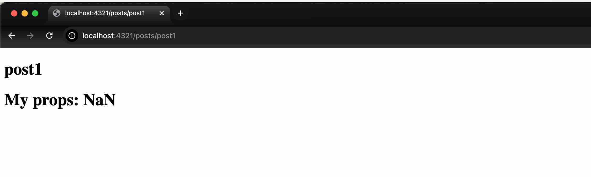
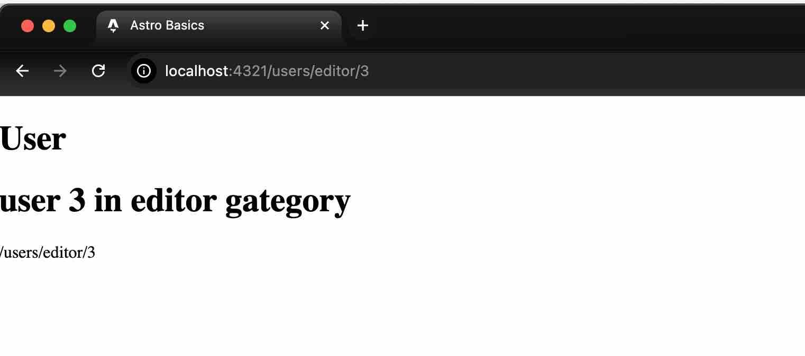

# posts/[slug]
- របៀបប្រើ params ជាមួយ slug

- របៀបប្រើ params post សម្រាប់ទាញទិន្ន័យ


# user/[category]/[slug]
- **Multiple Parameters**


## file tree 
```
├── 📁 src/
│   ├── 📁 assets/
│   │   ├── 📁 image/
│   │   │   ├── 🖼️ 1-params.jpg
│   │   │   └── 🖼️ 2-multi.jpg
│   │   ├── 🖼️ astro.svg
│   │   └── 🖼️ background.svg
│   ├── 📁 components/
│   │   └── 📄 Welcome.astro
│   ├── 📁 layouts/
│   │   └── 📄 Layout.astro
│   └── 📁 pages/
│       ├── 📁 posts/
│       │   └── 📄 [slug].astro
│       ├── 📁 users/
│       │   └── 📁 [gategory]/
│       │       └── 📄 [id].astro
│       └── 📄 index.astro
```