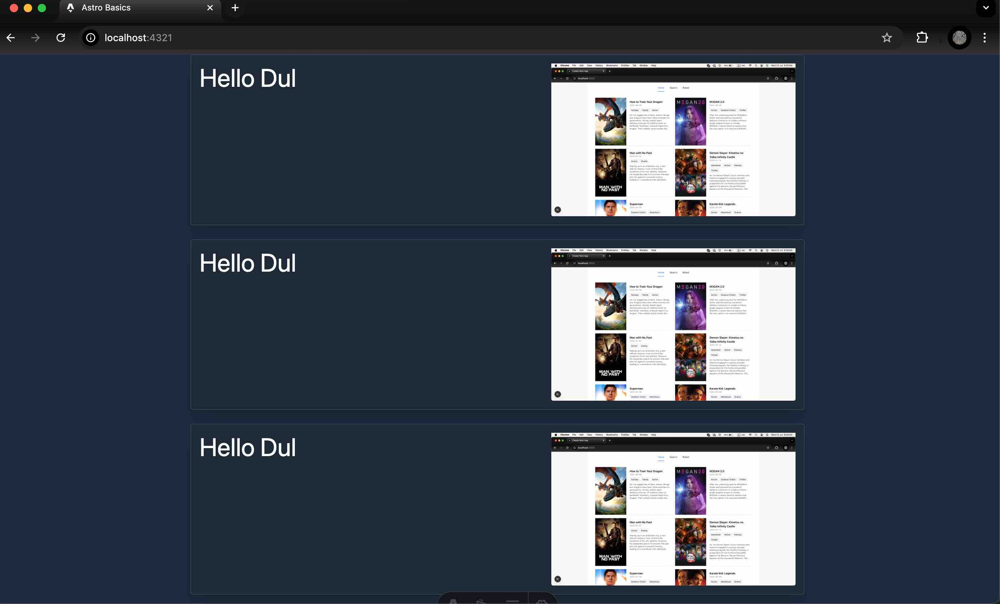

# image demo


### AOS CDN
```ts
<meta name="generator" content={Astro.generator} />
    <title>Astro Basics</title>
    <!-- AOS CSS -->
    <link  href="https://unpkg.com/aos@2.3.1/dist/aos.css" rel="stylesheet">
  </head>
  <body>
    <slot />

    <!-- AOS JS -->
     <script is:inline src="https://unpkg.com/aos@2.3.1/dist/aos.js"></script>
      <script is:inline>
        AOS.init();
      </script>
  </body>
</html>

<style>
```
### withd device
```ts
w-full - ធ្វើឱ្យរូបភាពពេញទំហំនៅលើ mobile
md:max-w-[350px] - កំណត់ max-width នៅលើ desktop តែប៉ុណ្ណោះ
លុបចេញ max-w-[350px] - ដើម្បីឱ្យរូបភាពអាចពេញទំហំនៅលើ mobile

ឥឡូវនេះរូបភាពនឹង:

Mobile: ពេញទំហំ container
Desktop: រក្សាទំហំចុងបំផុត 350px ដូចដើម
```
## AOS aminate 
```ts
1. JavaScript Enhancement:
ប្រើ DOMContentLoaded ដើម្បីធានាថា DOM បានផ្ទុកទាំងអស់

2. AOS Attributes បន្ថែម:

Text: data-aos="fade-right" ជាមួយ data-aos-delay="200"
Image: data-aos="fade-left" ជាមួយ data-aos-delay="400"

3. AOS Options កែលម្អ:

offset: 100 - ចាប់ផ្តើម animate នៅចម្ងាយ 100px
once: false - animate រាល់ពេលដែល scroll
mirror: true - animate ពេល scroll ឡើងវិញ
anchorPlacement: 'top-bottom' - កំណត់ចំណុច trigger

4. Animation Effects ផ្សេងទៀតដែលអ្នកអាចប្រើ:

fade-up, fade-down, fade-left, fade-right
slide-up, slide-down, slide-left, slide-right
zoom-in, zoom-out
flip-left, flip-right, flip-up, flip-down
```